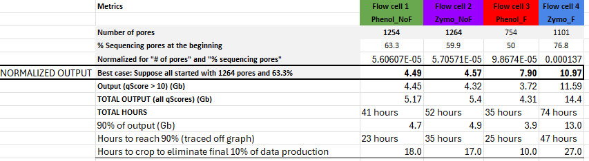

```{r setup, include=FALSE}
knitr::opts_chunk$set(echo = T)
```

```{r}
# Load necessary packages
pacman::p_load(tidyverse, dplyr, knitr, here, ggplot2)

# Import the datasets from pore pore scan plot
porecount2 <- read_csv(here("data", "porecount2.csv"))
```
## Run performance will be assessed by two measures and compared between the four runs:

- Phenol + no fragmentation
- Phenol + fragmentation
- Zymo kit + no fragmentation
- Zymo kit + fragmentation

## 1. Adjusted predicted output and 2. Pore depletion rate over time

### 1. Adjusted predicted output

We cannot directly compare the data output from each of the four runs because there are additional factors which have influence as well as the properties of the library pool istelf and how it was prepared. If we control for two key variables then we can predict what the output would have been, if certain variables had been equal across the runs. 

We have found that the there are two key attributes of the flow cell which impact total run output. These are "Initial number of pores available" and "Percentage of pores sequencing" at the start of the run. The inital number of pores available is related to the age of the flow cell but also varies between flow cells within the same batch.The first pore scan performed in a sequencing run returns the number of available pores. A higher number of pores available at the beginning of a run will result in higher data output. The "Percentage of pores sequencing" is related to the amount (fmol) of library pool you load to the flow cell. Despite selecting a loading concentration (18fmol) and diluting the library to this value, there is room for error given the tiny volumes of liqued involved <2uL and so "Percentage of pores sequencing" can be a proxy for loading concentration (fmol). If we are to compare the data output (Gb) for 4 runs with different sets of samples, we must control for these two variables across the four runs. 

Our evidence from other runs suggests that loading concentration is directly correlated with "Percentage of sequencing pores" and that this can be used as a proxy. 
```{r}
# Creating the dataframe
pores_data <- data.frame(
  Run = c("Run 1", "Run 2", "Run 3", "Run 4"),
  Input_concentration_fmol = c(20, 50, 65, 70),
  Percent_Sequencing_Pores = c(37.2, 66.4, 80, 82.4)
)

# Viewing the dataframe
print(pores_data)

# Create the scatter plot
ggplot(pores_data, aes(x = Input_concentration_fmol, y = Percent_Sequencing_Pores)) +
  geom_point() +  
  geom_smooth(method = "lm", se = FALSE, color = "blue") +
  labs(x = "Flow cell loading concentration (fmol)", y = "Percentage of Sequencing Pores at the Beginning") +
  ggtitle("Effect of loading concentration on percentage of sequencing pores") +
  theme_minimal() 
```

The top half of the following table was use to predict the expected data output from each flow cell if it had started with 63.3% sequencing pores at the start, and 1264 pores at the beginning. 

```{r echo=FALSE, out.width='50%', fig.align='center'}

```
We can see that the predicted data output for Zymo + Fragmentation condition is the highest. Within both the Phenol pair and the Zymo kit pair of flow cells, the one with fragmentation outperforms no fragmentation. Within the fragmented pair and the pair not fragmented, the Zymo kit outperforms the Phenol condition although the predicted values are very close between phenol not fragmented condition and the zymo not fragmented condition.  

The bottom half of the table was used to calcualte how many hours to crop off the end of the run which will be used in later analysis. 

## 2. Pore depletion rate over time


# Plot the pore count data (number of active pores)

```{r}
# Plot the raw data
ggplot(data=porecount2, aes(x=Hour, y=`Number of available pores`, color=Group))+ geom_point() + labs(title= "Number of active pores over time") + theme_minimal()
```

The data was log transformed to linearise it.

```{r}
# plot the data using a log transformation on the y axis to make the data linear
ggplot(data=porecount2, aes(x=Hour, y=log(`Number of available pores`),color=Group))+ geom_point() + labs(title= "Number of active pores over time") + theme_minimal()
```

Edit data to crop the first hour (hour 0) from each run. Because in some
cases the number of available rises before falling. Later we will also
removed the final part of the run, where percentage of pores sequencing
is variable and non-informative as it tails off towards zero.

### Apply a linear model to the data with the first hour cropped and normalised to all begin from the same point.

```{r}
# Import dataset with first hour removed and normalised pore count column adjusted to the value in hour=1. 
porecount3 <- read_csv(here("data", "porecount3.csv"))
```

```{r}
# Apply simple linear regression model
lm_1 <- lm(log(`Number of available pores`) ~ Hour * Group, data = porecount3)

# summarise simple linear regression model
summary(lm_1)

# Plot overlaid linear model
ggplot(data=porecount3, aes(x=Hour, y=log(`Normalised number of pores`),color=Group))+ geom_point() + labs(title= "Number of available pores over time (normalized)") + geom_smooth(method = "lm", formula = y ~ x, se = FALSE) + theme_minimal()
```

The highly disperse points at the final hours of each run seem to impact the slope of the line. We should crop the final hours of each run. We will still interpret the model to compare with the next (cropped) model. 

### Interpretation of linear model coefficients:

Rate of decrease of available pores in Phenol Fragmented group =
Baseline = -0.074493

Phenol No Fragmented = -0.074493 + -0.006560 = `r -0.074493 + -0.006560`

Zymo Kit Fragmented = -0.074493 + 0.031813 = `r -0.074493 + 0.031813`

Zymo Kit No Fragmented = -0.074493 + 0.015106 = `r -0.074493 + 0.015106`

## Pairwise comparisons 

### Phenol No Fragmented vs Zymo No Fragmented. RESULT = Zymo No Fragmented is better (sig = \*\*\*)

```{r}
lm_comparison1 <- lm(log(`Normalised number of pores`) ~ Hour * Group,
                              data = porecount3[porecount3$Group == 'Zymo Kit No Fragmented' | 
                                                 porecount3$Group == 'Phenol No Fragmented',])
summary(lm_comparison1)
```

### Phenol No Fragmented vs Phenol Fragmented. RESULT = Phenol fragmented is better (sig = \*)

```{r}
lm_comparison2 <- lm(log(`Normalised number of pores`) ~ Hour * Group,
                              data = porecount3[porecount3$Group == 'Phenol Fragmented' | 
                                                 porecount3$Group == 'Phenol No Fragmented',])
summary(lm_comparison2)
```

Note - the following hours are less than the max_hours calculated above
because each pore scan is done ever 1hr4 mins so there are less
datapoints than for the occupancy data. r 'print(max_hours)\`

# Remove final seqeuncing hours from each condition after 90% of data has been generated

Now cut off the final sequencing hours which is uninformative and highly
variable and disperse and only accounts for a small amount of the data
output. We keep only the linear region of each plot.

Number of hours that each run lasted:

r `print(max_hours)`

Now cut off the final part of the sequencing run to remove variablitiy
and keep only the linear region of each plot.

Hours to cut off from each run:

-   **Phenol Fragmented:**\
    90% = Cut off 10 hours
-   **Phenol No Fragmented:**\
    90% = Cut off 18 hours
-   **Zymo Kit Fragmented:**\
    90% = Cut off 27 hours
-   **Zymo Kit No Fragmented:**\
    90% = Cut off 17 hours

```{r}
# Calculate the maximum hour for each group
max_hours <- porecount3 %>%
  group_by(Group) %>%
  summarise(MaxHour = max(Hour))
# Merge the maximum hours with the original data
porecount3 <- porecount3 %>%
  left_join(max_hours, by = "Group")
```

```{r}
# Applying the crop conditions for each group
cropped_90_count <- porecount3 %>%
  filter(
    (Group == "Zymo Kit Fragmented" & Hour <= (MaxHour - 27)) |
    (Group == "Zymo Kit No Fragmented" & Hour <= (MaxHour - 17)) |
    (Group == "Phenol No Fragmented" & Hour <= (MaxHour - 18)) |
    (Group == "Phenol Fragmented" & Hour <= (MaxHour - 10))
  )

```

```{r}
# simple linear regression model
lm2 <- lm(log(`Normalised number of pores`) ~ Hour * Group, data = cropped_90_count)

# summarise simple linear regression model
summary(lm2)

# Plot overlaid linear model
ggplot(data=cropped_90_count, aes(x=Hour, y=log(`Normalised number of pores`),color=Group))+ geom_point() + labs(title= "Normalised count of sequencing pores over time (90% of data)") + geom_smooth(method = "lm", formula = y ~ x, se = FALSE) + theme_minimal()
```

### Interpretation of linear model coefficients: Rate of decrease of

available pores in Phenol Fragmented group = Baseline = -0.086804

Phenol No Fragmented = -0.086804 + -0.010362 = `r -0.086804 + -0.010362`

Zymo Kit Fragmented = -0.086804 + 0.043981 = `r -0.086804 + 0.043981`

Zymo Kit No Fragmented = -0.086804 + 0.009686 = `r -0.086804 + 0.009686`

## Pairwise comparisons

### Phenol No Fragmented vs Zymo No Fragmented. RESULT = Zymo No Fragmented is better 0.02 (sig = \*\*\*)

```{r}
lm_comparison3 <- lm(log(`Normalised number of pores`) ~ Hour * Group,
                              data = cropped_90_count[cropped_90_count$Group == 'Zymo Kit No Fragmented' | 
                                                 cropped_90_count$Group == 'Phenol No Fragmented',])
summary(lm_comparison3)
```

### Phenol No Fragmented vs Phenol Fragmented. RESULT = Phenol no fragmented is worse -0.01 (sig = \*\*\*)

```{r}
lm_comparison4 <- lm(log(`Normalised number of pores`) ~ Hour * Group,
                              data = cropped_90_count[cropped_90_count$Group == 'Phenol Fragmented' | 
                                                 cropped_90_count$Group == 'Phenol No Fragmented',])
summary(lm_comparison4)
```

### Phenol Fragmented vs Zymo Fragmented. RESULT = Zymo Fragmented is better 0.04 (sig = \*\*\*)

```{r}
lm_comparison5 <- lm(log(`Normalised number of pores`) ~ Hour * Group,
                              data = cropped_90_count[cropped_90_count$Group == 'Zymo Kit Fragmented' | 
                                                 cropped_90_count$Group == 'Phenol Fragmented',])
summary(lm_comparison5)
```
### Zymo Kit No Fragmented vs Zymo Kit Fragmented. RESULT = Zymo Kit no fragmented is worse -0.03 (sig = \*\*\*)

```{r}
lm_comparison6 <- lm(log(`Normalised number of pores`) ~ Hour * Group,
                              data = cropped_90_count[cropped_90_count$Group == 'Zymo Kit Fragmented' | 
                                                 cropped_90_count$Group == 'Zymo Kit No Fragmented',])
summary(lm_comparison6)
```


## Conclusion

The pairwise comparisons in terms of the rate of decline in available pores shows that Zymo Kit is always associated with a slower decline vs Phenol and fragmentation always has slower decline as compared with the "not fragmented" conditions. 

The two analyses for assessing the performance of the sequencing runs are in agreement and both undoubtedly show the superior performance of the Zymo Kit when used with fragmented samples. In both analyses this combination of conditions is markedly better then any other conditions.

The only slight conflict in results is that in the table of predicted data outputs, the two "not fragmented conditions were the worst" whereas in the pore depletion analysis, the two phenol methods are the worst. 
